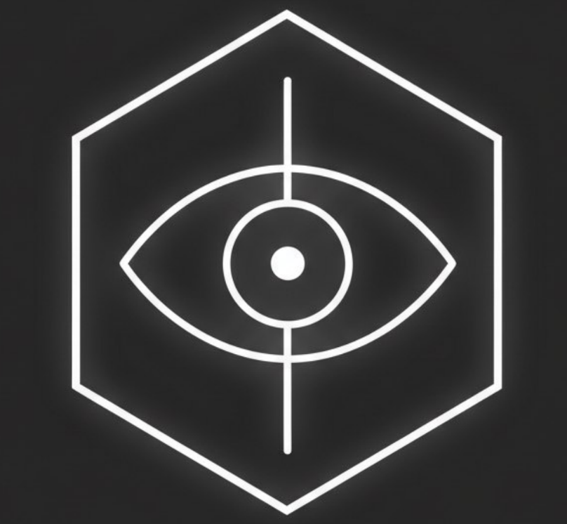

# BORIS
### Black Oracle Risk Inspection System

**Automated threat surface intelligence for Web3 protocols.**

Code doesn't lie. Narratives do.

---

## What is BORIS

BORIS is not a linter. Not a "rug checker". Not a vibe score.

BORIS is a **multi-layer security intelligence system** that maps:
- what the code actually does
- who controls it
- how capital can move
- whether on-chain behavior matches the narrative

Every layer feeds into every other layer.  
When code risk aligns with holder concentration aligns with governance capture aligns with derivatives squeeze — that's not noise. That's signal.

---

## Architecture

<table>
<tr>
<td colspan="6" align="center">

**CROSS-LAYER CORRELATION**
`Code ↔ Onchain ↔ Holders ↔ Market ↔ Social ↔ Deriv`

</td>
</tr>
<tr>
<td align="center">📦 <b>STATIC</b> Code Analysis</td>
<td align="center">🔎 <b>ONCHAIN</b> Struct + ABI</td>
<td align="center">⚠️ <b>MARKET</b> Spot + Derivs</td>
<td align="center">🛰 <b>SOCIAL</b> Intel</td>
<td align="center">🔐 <b>GOVERNANCE</b> Privilege</td>
<td align="center">🏗 <b>STRUCT</b> Profiling</td>
</tr>
<tr>
<td colspan="6" align="center">

**TEMPORAL ENGINE** — `Role Δ · Upgrade Δ · Holder Drift · OI Δ`

</td>
</tr>
</table>

---

## Capability Matrix

<b>📦 Static Code Analysis</b>

**Languages:** Solidity · Rust · Move (Aptos/Sui) · Go · Python · Java · C++ · TypeScript · TON (FunC/Tact/Fift) · Elixir · Shell

**Engines:** Slither · Mythril · Aderyn · Semgrep + custom detectors

| Detection | Severity |
|-----------|----------|
| Reentrancy (standard + read-only) | CRITICAL |
| Delegatecall misuse | CRITICAL |
| Arbitrary call surface | CRITICAL |
| Emergency drain patterns | CRITICAL |
| Hidden backdoor signatures | CRITICAL |
| Unchecked transfer / return | HIGH |
| Oracle dependency | HIGH |
| Mint / burn without bounds | HIGH |
| Proxy upgrade surface | HIGH |
| Storage collision | HIGH |
| Privileged role escalation | MEDIUM |
| Flash-loan governance vectors | MEDIUM |

- File:line precise mapping  
- Archetype normalization (DEX / stablecoin / lending / governance) — reduces false positives  
- Pattern classification: CRITICAL / HIGH / MEDIUM / LOW / INFO

<b>🔎 Onchain Structural Analysis</b>

**Chains:** Ethereum · BSC · Polygon · Arbitrum · Base · Optimism · Solana · Tron · Stellar

**Proxy Resolution:**
- ERC1967, UUPS, Transparent Proxy, custom patterns
- Implementation discovery + upgrade surface detection
- Storage layout inspection + collision detection

**Role & Control Mapping:**
- Privileged role extraction + distribution
- Admin function surface (pause / blacklist / emergencyWithdraw)
- Multi-contract linkage: factory → router → vault → token
- Deployment graph awareness

**ABI Surface Intelligence:**
- Privileged / payable / fallback function extraction
- State-changing vs view classification
- Cross-contract callable surface
- Upgradeable exposure mapping

**Trust Model:**
- Explicit + implicit trust assumption mapping
- Governance override surface
- Emergency privilege exposure
- Trust failure consequence modeling

<b>🔗 Exploit Chain Modeling</b>

Invariant Correlation Engine connects isolated findings into real attack paths.

| Chain | Prerequisites |
|-------|--------------|
| Flash-loan + governance capture | Token vote, no snapshot, unprotected proposal |
| Proxy hijack via delegatecall | Delegatecall to user-controlled address |
| Admin rug: drain + upgrade combo | Owner key, untimelocked upgrade |
| Oracle manipulation → liquidation cascade | Spot oracle on thin pool |
| Storage corruption via proxy collision | Overlapping storage slots |
| Infinite approval → token drain | Approve to arbitrary address |
| Cross-file privilege escalation | Role granted in initializer |

Every chain output includes:
- Prerequisite conditions
- Context amplifiers (liquidity depth, holder concentration, role density)
- Likelihood / impact heuristic score
- File + contract binding

<b>💰 Funds Flow Intelligence</b>

- Wash trading detection (cyclic flows, same-block roundtrips)
- Bot pattern identification (timing, repetition, gas clustering)
- Admin drain vs protocol-internal flow separation
- CEX consolidation vs owner extraction classification
- Sybil cluster detection via graph analysis
- Whale flow concentration scoring
- Temporal activity spikes + anomaly flagging
- LP pool specific analysis
- Multi-chain address fingerprinting

<b>🐋 Holder Model</b>

- Holder distribution index
- Top-10 concentration with CEX / LP address correction
- Whale classification + dominance scoring
- Contract holder detection (proxy holders, vesting, multisig)
- Governance concentration heuristics
- LP concentration risk
- Extreme single-holder detection

**Sources:** Etherscan · BscScan · Blockscout · Helius (Solana) · Tronscan

<b>📊 Market Layer (Spot)</b>

- DEX pool aggregation (DexScreener)
- Liquidity depth + pool fragmentation analysis
- Volume / liquidity ratio
- CEX presence detection (CoinGecko)
- Organic activity estimation
- Cyclic transaction sequence detection
- Flow manipulation heuristics
- Peak index detection

<b>⚠️ Derivatives Analysis</b>

**Exchanges:** Binance · Bybit · OKX

**Open Interest:**
- Cross-exchange OI aggregation
- OI velocity (position buildup speed)
- OI vs price divergence
- OI vs volume / market cap ratio
- OI concentration risk

**Positioning:**
- Funding rate extremes + trend
- Long / short ratio (all three exchanges)
- Top trader vs retail divergence
- Aggressor flow (taker buy/sell pressure)
- Cross-exchange L/S divergence

**Risk Modeling:**
- Liquidation cascade detection (1h real-time + 24h historical)
- Squeeze setup identification
- Leverage buildup + crowded positioning flags
- Thin orderbook + high OI = manipulation conditions
- Synthetic leverage density estimation

**Detects:**
`leverage buildup` · `crowded positioning` · `squeeze setups` · `cascade risk` · `manipulation conditions`

<b>🛰 Social Intelligence</b>

**Platforms:** Telegram · Twitter/X · Discord

| Signal | What we look for |
|--------|-----------------|
| Subscriber count vs engagement | Dead community detection |
| Post reaction / coverage ratio | Hollow engagement |
| Content analysis | Scam / shill / signal patterns |
| Channel age vs project age | Astroturfing signals |
| Account creation context | Coordinated launch detection |
| Follower/following ratio | Bot army flags |
| Server age + verification | Discord trust baseline |

- Impersonation detection (Levenshtein + pattern matching)
- Cross-platform consistency scoring
- Risk score (0–100) + Trust score (0–100)
- Ecosystem vs official account separation

<b>📉 Audit Drift Analysis</b>

Audits are snapshots. Code keeps moving.

- PDF audit parsing (OpenZeppelin, Trail of Bits, Sherlock, Code4rena, etc.)
- Repo vs deployed bytecode divergence detection
- Git diff from audit commit: new files, changed functions, deleted guards
- Severity drift tracking (what got worse)
- Governance mutation detection post-audit
- New execution surface without audit coverage
- Alignment index: which findings are still relevant, which are orphaned

<b>📡 Continuous Radar</b>

**GitHub Radar** — real-time new repository monitoring  
Scores repos across 20+ signals: governance risk, admin patterns, flash-loan vectors, force-push activity  
Auto-launches scanner on top findings

**DeFiLlama Radar** — new protocol detection  
TVL filtering, category tagging, GitHub repo discovery, CoinGecko enrichment

**Verified Contract Radar** — new on-chain contracts  
RPC + Etherscan V2 API · ETH, BSC, Polygon, Arbitrum, Base, Optimism

**Stellar/Soroban Radar** — specialized  
New assets via Horizon API, SDEX orderbook monitoring, scam factory detection

<b>🧪 Cross-Layer Correlation Engine</b>

Code says timelock exists    →  Onchain shows it was never deployed
Holders 92% concentrated     →  Governance quorum = 1 wallet
Thin DEX pool                →  Spot oracle price feed = manipulation vector
Wash trading pattern         →  Mint control = extraction setup
“Fully decentralized DAO”    →  pause() + blacklist() in code = narrative mismatch
Attacker mock in /test       →  No corresponding finding in audit = undocumented surface

Every layer amplifies or contradicts every other.  
Correlation is where the real signal lives.

---

## Tiers

|  | 👁️ GUEST | 🟥 RADAR | 📋 RAW | 🔥 BLACKBOX |
|--|:--:|:--:|:--:|:--:|
| **Price** | Free | $19/mo | $29/mo | $49/mo |
| **Scans / day** | 3 | 25 | 30 | Unlimited |
| **Parallel scans** | 1 | 1 | 1 | 2 + queue 5 |
| | | | | |
| **Summary** | ✓ | ✓ | ✓ | ✓ |
| **Risk categories + severity** | — | ✓ | ✓ | ✓ |
| **Governance analysis** | — | ✓ | ✓ | ✓ |
| **Admin control score** | — | ✓ | ✓ | ✓ |
| **Behavioral score (aggregated)** | — | ✓ | ✓ | ✓ |
| **Audit context (presence, age)** | — | ✓ | ✓ | ✓ |
| | | | | |
| **Full findings + file:line** | — | — | ✓ | ✓ |
| **Archetype + governance model** | — | — | ✓ | ✓ |
| **Holders / liquidity / deployments** | — | — | ✓ | ✓ |
| **CEX listings** | — | — | ✓ | ✓ |
| **Raw data dump — no verdicts** | — | — | ✓ | ✓ |
| | | | | |
| **Exploit paths + attack vectors** | — | — | — | ✓ |
| **Audit drift (full)** | — | — | — | ✓ |
| **Deploy trace analysis** | — | — | — | ✓ |
| **Code fragments + exact location** | — | — | — | ✓ |
| **Social intelligence** | — | — | — | ✓ |
| **Funds Flow Intelligence** | — | — | — | ✓ |
| | | | | |
| **📡 Discovery feed** | — | ✓ | ✓ | ✓ |
| **📡 Continuous Radar 24/7** | — | ✓ | ✓ | ✓ |
| **📊 DeFiLlama scanner 24/7** | — | ✓ | ✓ | ✓ |
| **Alerts** | — | Batched 12–24h | Batched 12–24h | Instant |
| | | | | |
| **JSON export** | — | Summary | Full technical | Full |
| **Beta access** | — | — | — | First |

> **RAW** — no scores, no verdicts, no interpretations.  
> Pure technical data for people who read code, not conclusions.

---

## Quick Start
Open @BlackOracleBORIS_bot on Telegram
Send /start
Drop a contract address, GitHub repo URL, or token ticker
Receive your report

No API keys. No setup. No CLI required.

---

## What BORIS Does Not Do
✗  Does not call anything “safe”
✗  Does not call anything a “scam”

✗  Does not give investment advice
✗  Does not account for brand, reputation, or team size
✗  Does not guarantee exploit-free status

BORIS maps control surfaces and capital mobility.  
What you do with that map is your decision.

---

## Links

| | |
|---|---|
| 🤖 Bot | [@BlackOracleBORIS_bot](https://t.me/BlackOracleBORIS_bot) |
| 📡 Channel EN | [t.me/Black_Oracle_BORIS_eng](https://t.me/Black_Oracle_BORIS_eng) |
| 📡 Channel RU | [t.me/Black_Oracle_BORIS_ru](https://t.me/Black_Oracle_BORIS_ru) |
| 🐦 Twitter/X | [@BlackOracleRoot](https://x.com/BlackOracleRoot) |

---

## Docs

- [`docs/architecture.md`](docs/architecture.md) — full system architecture
- [`docs/signals.md`](docs/signals.md) — signal list and weights
- [`docs/tiers.md`](docs/tiers.md) — tier breakdown
- [`examples/sample_report.md`](examples/sample_report.md) — example security report
- [`examples/sample_market.md`](examples/sample_market.md) — example market scan
- [`CHANGELOG.md`](CHANGELOG.md) — version history

---

**Code doesn't lie.**  
**BORIS reads the code.**

*Not investment advice. Not a guarantee. A map.*

